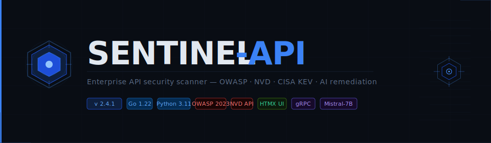

                   

# Sentinel-API

> **Production-grade API security scanner** — Go enumeration engine · Python AI intelligence layer · HTMX real-time dashboard · NVD API 2.0 CVE integration
> Version **2.4.1** · OWASP API Security Top 10 (2023) · CISA KEV · Single-machine deployment

---

## Overview

Sentinel-API is an enterprise-ready API security scanner built on a Go/Python hybrid architecture. The Go engine runs high-concurrency OWASP checks; the Python layer runs a local Mistral-7B LLM for code-level remediation; NVD API 2.0 delivers live CVE data enriched with CISA KEV status; the HTMX dashboard streams scan progress in real time with zero JavaScript framework overhead.

```
┌─────────────────────────────────────────────────────────────────────────┐
│  Browser                                                                │
│    ws://ui:3000/ws/scan/{id} ──► UI Server (HTMX/Jinja2)                │
│    GET/POST /partials/*      ──► (FastAPI SSR)                          │
└──────────────────────────────────────┬──────────────────────────────────┘
                                       │ httpx proxy
┌──────────────────────────────────────▼───────────────────────────────────┐
│  AI Backend (Python FastAPI + gRPC)                                      │
│    POST /analyze-findings   (HTTP — external CI/CD)                      │
│    gRPC AnalyzeFindings     (preferred — internal scanner calls)         │
│    gRPC StreamScanEvents    (live progress → WebSocket fan-out)          │
│    GET  /history/**         (DuckDB trend data)                          │
│    WS   /ws/scan/{id}       (event bus → browser)                        │
└──────────────────────────────────────┬───────────────────────────────────┘
               grpc://                 │                    http://
┌──────────────────────────────────────▼───────────────────────────────────┐
│  Go Scanner Engine                                                       │
│    Stage 0a  engine.Client.Fingerprint()   — TLS, WAF, gateway           │
│    Stage 0b  nvd.LookupServer()            — NVD API 2.0 + CISA KEV      │
│              nvd.CVEToFindings()           — inject CVE findings         │
│    Stage 1   discovery.Enumerator.Run()    — concurrent path enum        │
│    Stage 2   analyzer.Analyzer.Run()       — OWASP API1–API10            │
│    Stage 3   RankEngine.ScoreScan()        — SentinelRank weighted score │
│              reporter.Finalise()           — JSON + Markdown reports     │
└──────────────────────────────────────────────────────────────────────────┘
```

---

## Repository Layout

```
sentinel-api/
├── scanner/                          Go enumeration engine
│   ├── cmd/main.go                   Cobra CLI — all flags including NVD
│   ├── internal/
│   │   ├── models/models.go          Shared types — CVEDetail, TechStack, Finding…
│   │   ├── engine/
│   │   │   ├── client.go             HTTP client, TTFB trace, TLS, fingerprinting
│   │   │   └── orchestrator.go       Four-stage pipeline + CVE injection
│   │   ├── nvd/
│   │   │   ├── client.go             NVD API 2.0 client — live lookup, CISA KEV
│   │   │   ├── findings.go           CVEDetail → models.Finding conversion
│   │   │   └── export.go             StaticFallbackPublic() shim
│   │   ├── discovery/enumerator.go   Phase 1: concurrent enumeration + shadow detection
│   │   ├── analyzer/
│   │   │   ├── owasp_checks.go       Phase 2: OWASP API1–API10 check functions
│   │   │   └── sentinel_rank.go      Phase 3: SentinelRank scoring + report builder
│   │   └── reporter/reporter.go      Phase 4: JSON/MD output + AI backend push
│   ├── configs/sentinel-api.yaml     Default configuration
│   ├── go.mod
│   └── Dockerfile
│
├── ai/                               Python FastAPI AI intelligence layer
│   ├── main.py                       FastAPI app — HTTP routes + WebSocket
│   ├── core/
│   │   ├── config.py                 Pydantic settings
│   │   ├── models.py                 Pydantic schemas (mirror Go models.go)
│   │   ├── llm.py                    Mistral-7B wrapper — OWASP prompts, retry, cache
│   │   ├── sentinel_rank.py          Python SentinelRank engine (mirrors Go)
│   │   └── event_bus.py              asyncio pub/sub for WebSocket fan-out
│   ├── db/database.py                DuckDB — history, remediation cache, analytics
│   ├── grpc/server.py                gRPC servicer (AnalyzeFindings, StreamScanEvents…)
│   ├── tests/
│   │   ├── test_sentinel_rank.py     Unit tests — scoring engine
│   │   └── test_api.py               Integration tests — HTTP endpoints
│   ├── requirements.txt
│   └── Dockerfile
│
├── ui/                               HTMX dashboard (Python/Jinja2 SSR)
│   ├── main.py                       FastAPI UI server — routes + WS proxy
│   ├── config.py                     UI server settings
│   ├── templates/
│   │   ├── base.html                 Master layout — HTMX, Alpine.js, Tailwind
│   │   ├── pages/
│   │   │   ├── index.html            Dashboard overview
│   │   │   ├── scan.html             Scan launch form
│   │   │   ├── results.html          Scan results — lazy-loaded tab panels
│   │   │   └── history.html          History + Chart.js trend charts
│   │   └── partials/
│   │       ├── health_badge.html     Live AI service status (polled 10s)
│   │       ├── scan_progress.html    Real-time scan log via WebSocket
│   │       ├── techstack_card.html   Fingerprint + score ring + CVE count
│   │       ├── findings_list.html    Collapsible finding cards + AI remediation
│   │       ├── endpoints_table.html  Filterable endpoint table
│   │       ├── owasp_grid.html       OWASP Top 10 coverage grid
│   │       ├── cve_table.html        NVD CVE table with KEV badges
│   │       ├── shadow_list.html      Shadow/zombie API list
│   │       ├── ratelimit_probes.html TTFB degradation table
│   │       └── directory_tree.html   SentinelRank risk directory map
│   ├── static/
│   │   ├── css/sentinel.css          Custom animations + collapse + scan log colours
│   │   └── js/sentinel.js            Tab routing, Alpine collapse, HTMX config
│   ├── requirements.txt
│   └── Dockerfile
│
├── proto/sentinel.proto              gRPC service definition
├── scanner-grpc/                     Go gRPC client + GRPCOrchestrator
│   └── internal/
│       ├── grpc/client.go            AnalyzeFindings, StreamScanEvents, Health
│       └── engine/orchestrator_grpc.go  GRPCOrchestrator with event streaming
├── docker-compose.yml                Full stack deployment
├── Makefile                          proto, test, build, model-download targets
├── QuickStart.md                     Getting-started guide
└── README.md                         This file
```

---

## Quick Start

### Prerequisites

| Requirement | Min version |
|---|---|
| Go | 1.22+ |
| Python | 3.11+ |
| Docker + Compose | 24+ |
| RAM | 8 GB (16 GB recommended for LLM) |

### Build and run

```bash
# Build Go scanner
cd scanner && go mod tidy && go build -o sentinel-api ./cmd/main.go

# Download Mistral-7B model (≈4 GB)
make download-model

# Generate gRPC stubs
make proto

# Start full stack
make up   # or: docker compose up -d ai ui
```

Open the dashboard: **http://localhost:3000**

### Run a scan

```bash
# From the dashboard (browser) — use the New Scan form at /scan

# From CLI
./scanner/sentinel-api scan \
  --target https://api.example.com \
  --token "eyJ..." \
  --nvd-lookup \
  --nvd-api-key "YOUR-NVD-KEY" \
  --ai-backend grpc://localhost:50051 \
  --output ./reports
```

See **QuickStart.md** for full setup, Docker, CI/CD, and NVD key registration.

---

## Scan Pipeline

### Stage 0a — Fingerprint (`engine/client.go → Fingerprint()`)

Probes 7 well-known paths. Captures: TLS version via `VerifyConnection()` hook, WAF via `detectWAF()`, API gateway via `detectGateway()`, backend language via `inferLanguage()`.

### Stage 0b — NVD CVE Enrichment (`nvd/client.go → LookupServer()`)

Activates when `--nvd-lookup` is set.

1. `parseServerBanner()` extracts product/version pairs with a regex from the Server header (`nginx/1.18.0`, `Apache/2.4.51`, etc.)
2. `buildCPE()` constructs CPE 2.3 strings for known vendors; falls back to keyword search
3. NVD API 2.0 (`services.nvd.nist.gov/rest/json/cves/2.0`) is queried per component
4. `pickBestCVSS()` selects the highest-precedence score (v4.0 > v3.1 > v3.0 > v2.0)
5. CISA KEV catalogue is fetched from `cisa.gov` and cross-referenced — `CVEDetail.Exploited=true` for any KEV entry
6. Results are TTL-cached (default 24 h) per `product@version` key
7. `nvd.CVEToFindings()` converts HIGH/CRITICAL CVEs (+ all KEV entries) into `models.Finding` structs injected into the pipeline before Stage 2

Rate limits: 5 req/30 s without API key, 50 req/30 s with `--nvd-api-key`. Register free at https://nvd.nist.gov/developers/request-an-api-key

### Stage 1 — Discovery (`discovery/enumerator.go`)

Bounded goroutine pool drains a work channel of path candidates. Each live response is enriched with auth type (re-probe without credentials), rate-limit header detection, and path classification (`StatusInternal`, `StatusZombie`). Shadow API detection via OpenAPI schema diff or `heuristicShadows()` pattern matching.

### Stage 2 — OWASP Analysis (`analyzer/owasp_checks.go`)

| Check | OWASP | Logic |
|---|---|---|
| `checkBOLA()` | API1 | `generateIDVariants()` — cross-user ID probe |
| `checkBrokenAuth()` | API2 | No-token, invalid JWT, `alg:none` bypass |
| `checkMassAssignment()` | API3 | Sends `{"role":"admin"}` in PUT/PATCH body |
| `probeRateLimit()` | API4 | 50-request burst · TTFB degradation >200% → `RecursiveRisk` |
| `checkBFLA()` | API5 | Admin path + user JWT → 200 confirms BFLA |
| `checkSSRF()` | API7 | AWS IMDS, GCP metadata, localhost payloads |
| `checkMisconfiguration()` | API8 | Wildcard CORS, missing HSTS, TRACE method |
| `checkPIILeakage()` | — | PAN, SSN, email, AWS keys, PEM keys via regex |

### Stage 3 — SentinelRank + Report (`analyzer/sentinel_rank.go`, `reporter/reporter.go`)

```
RiskScore = (CVSS × 10) × owaspWeight × assetCriticalityMultiplier
            × authStateMultiplier × piiMultiplier × kevMultiplier
```

KEV multiplier: `×1.20` for findings tagged `CISA-KEV`. Asset criticality: financial ×1.25, admin ×1.20, auth ×1.15, staging ×0.75. Overall scan score: `100 − clamp(weightedAvg + logPenalty, 0, 100)`.

`reporter.Finalise()` writes `reports/sentinel_<id>.json` + `.md`, pushes findings to the AI backend, and back-fills `Finding.Remediation` with LLM-generated code snippets.

---

## HTMX Dashboard

The dashboard at **http://localhost:3000** is server-side rendered (Jinja2 templates) with HTMX partial swaps. No JavaScript framework. Alpine.js provides collapsible finding cards.

### Pages

| Route | Description |
|---|---|
| `/` | Overview — AI health, recent scans table, quick scan form |
| `/scan` | Full scan launch form with all CLI options |
| `/results/{scan_id}` | Scan results — 7 lazy-loaded tab panels |
| `/history` | Full scan history + Chart.js trend and OWASP coverage charts |

### HTMX partial endpoints

| Route | Renders |
|---|---|
| `GET /partials/health` | AI service status badge (polled every 10 s) |
| `GET /partials/findings/{id}` | Collapsible finding cards with AI remediation code |
| `GET /partials/endpoints/{id}?filter=` | Filterable endpoint table |
| `GET /partials/owasp/{id}` | OWASP Top 10 coverage grid — pass/warn/fail |
| `GET /partials/cves/{id}` | NVD CVE table with CVSS, KEV badge, references |
| `GET /partials/shadow/{id}` | Shadow/zombie API list |
| `GET /partials/ratelimit/{id}` | Rate-limit probe results with TTFB degradation |
| `GET /partials/directory/{id}` | SentinelRank directory risk map |
| `GET /partials/techstack/{id}` | Fingerprint card — score ring + CVE strip |
| `POST /partials/scan/start` | Launches scan subprocess, returns progress panel |
| `WS /ws/scan/{id}` | Proxies AI backend WebSocket → browser scan log |

---

## NVD CVE Integration

Enable with `--nvd-lookup`. Without it, a static fallback table (12 server/version entries) is used.

```bash
# Register for a free NVD API key at:
# https://nvd.nist.gov/developers/request-an-api-key

sentinel-api scan \
  --target https://api.example.com \
  --nvd-lookup \
  --nvd-api-key "YOUR-KEY"  # raises limit: 5 → 50 req/30s
```

NVD flags:

| Flag | Default | Description |
|---|---|---|
| `--nvd-lookup` | off | Enable live NVD API 2.0 lookup |
| `--nvd-api-key` | — | API key for 50 req/30 s limit |
| `--nvd-timeout` | 15s | Per-request timeout |
| `--nvd-cache-ttl` | 24h | In-memory cache TTL |
| `--nvd-offline` | off | Force static fallback (air-gapped) |

---

## AI Remediation

The Python AI layer (`ai/`) runs Mistral-7B-Instruct locally via `llama-cpp-python`. For each finding:

1. Check `remediation_cache` in DuckDB (keyed on OWASP category + severity + normalised path)
2. Build OWASP-specific prompt (`OWASP_SYSTEM_CONTEXTS` in `ai/core/llm.py`)
3. Run LLM inference with 3 retries (tenacity)
4. Cache result; back-fill `Finding.Remediation` via HTTP or gRPC

The gRPC `StreamScanEvents` RPC streams live scan events from the Go orchestrator to the event bus, which fans them out to connected browser WebSocket clients in real time.

---

## CLI Reference

```
sentinel-api scan [flags]

Target:
  -t, --target string             Target API base URL (required)
      --openapi string            OpenAPI spec URL for shadow API detection

Authentication:
      --token string              Bearer token
      --api-key string            API key (X-API-Key header)

Performance:
  -c, --concurrency int           Worker goroutines (default 25)
      --timeout duration          Per-request timeout (default 10s)
      --rate-limit int            Max requests/second (default 50)

NVD CVE Lookup:
      --nvd-lookup                Enable live NVD API 2.0 CVE lookup
      --nvd-api-key string        NVD API key (50 req/30s vs 5 req/30s)
      --nvd-timeout duration      NVD timeout (default 15s)
      --nvd-cache-ttl duration    NVD cache TTL (default 24h)
      --nvd-offline               Force static CVE fallback

Scan Modes (all enabled by default):
      --no-owasp                  Skip OWASP Top 10 checks
      --no-rate-test              Skip rate-limit burst testing
      --no-pii                    Skip PII detection
      --no-shadow                 Skip shadow API detection
      --fuzz                      Enable parameter fuzzing

Output:
  -o, --output string             Report directory (default ./reports)
      --ai-backend string         AI service URL (http:// or grpc://)
      --no-color                  Plain text (for CI log parsers)
  -v, --verbose                   Debug logging
      --config string             Path to sentinel-api.yaml
```

**Exit codes:** `0` = clean, `1` = critical findings (CI/CD gate).

---

## Tech Stack

| Layer | Technology | Purpose |
|---|---|---|
| Scanner | Go 1.22 | High-concurrency OWASP checks, NVD lookup, enumeration |
| HTTP | `net/http` + `httptrace` + `golang.org/x/time/rate` | TTFB tracing, token-bucket rate limiting |
| NVD | `net/http` (stdlib) | NVD API 2.0, CISA KEV catalogue |
| CLI | `github.com/spf13/cobra` | Command parsing, config merge |
| AI | Python 3.11, FastAPI, llama-cpp-python | Local Mistral-7B, remediation, gRPC service |
| Storage | DuckDB | In-process analytical DB for scan history trends |
| Dashboard | HTMX 1.9 + Alpine.js + Tailwind | SSR partial swaps, no JS framework |
| Charts | Chart.js 4 | Trend and OWASP coverage charts |
| gRPC | grpcio 1.63 / google.golang.org/grpc | Go↔Python event streaming |
| Logging | go.uber.org/zap / structlog | Structured, levelled logging |
| Deployment | Docker Compose | Single-machine, three-container stack |

---

## CI/CD Integration

```yaml
# .github/workflows/api-security.yml
name: Sentinel-API

on:
  pull_request:
    branches: [main]

jobs:
  scan:
    runs-on: ubuntu-latest
    steps:
      - uses: actions/checkout@v4
      - uses: actions/setup-go@v5
        with: { go-version: '1.22' }
      - run: cd scanner && go build -o sentinel-api ./cmd/main.go
      - run: |
          ./scanner/sentinel-api scan \
            --target https://staging.api.example.com \
            --token "${{ secrets.API_TOKEN }}" \
            --nvd-lookup \
            --nvd-api-key "${{ secrets.NVD_API_KEY }}" \
            --no-color \
            --output ./reports
      - uses: actions/upload-artifact@v4
        if: always()
        with: { name: sentinel-report, path: reports/ }
```

---

## Roadmap

- [x] Go enumeration engine — OWASP API Top 10 (2023)
- [x] Python AI layer — Mistral-7B local LLM + DuckDB
- [x] gRPC bridge — real-time event streaming
- [x] NVD API 2.0 — live CVE lookup + CISA KEV
- [x] HTMX dashboard — SSR real-time scan interface
- [ ] Parameter fuzzer — SSTI, SQLi, command injection via `--fuzz`
- [ ] API6 automation — business-flow abuse detection (stateful sequences)
- [ ] crAPI benchmark — accuracy validation against OWASP intentionally-vulnerable API
- [ ] Webhook alerting — Slack/Teams/PagerDuty on critical findings
- [ ] Scheduled scans — cron-based recurring scans with delta reports

---

*Sentinel-API v2.4.1 · Go 1.22 · Python 3.11 · OWASP API Security Top 10 (2023)*
